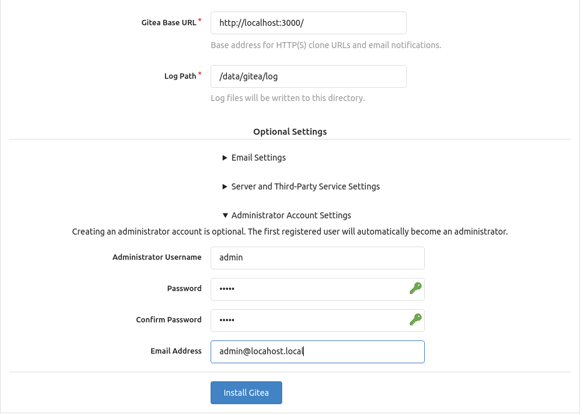

# GitOps example

It prepare for educational purpose about the GitOps methodology in the praktice. 

## Description

A little game to present a the GitOps.

The plan to easy to understand and lean more about the GitOps.  
This will show, how can anybody create a simple flow with a simple app. The goal is to create a simple web server with automated  deployment.

GitOps are not equal with these softwares only. You can use your favorite solutions for git GitHub, Gitlab, BitBucket etc. You can use ArgoCD instead of FluxCD. So lot of different solution are on the internet to apply GitOps methodology on your system. In this current case we will use the Kubernetes as infrastructure. 

Enviroment:

- Kubernetes with Kustomization

Used softwares to reach the goal:

- FluxCD
- Helm
- Kustomize
- Kubectx + kubens
- k9s

The solution will work on this way.

User send a git commit. FluxCD will be check it via the source controller` FluxCD component. If it has a new commit try to apply it on the system. The Kustomization supported by Kubernetes default. The Kustomize controller will update the configurtion on Kubernetes elements (Configmaps, Secrects, Deployments, Pods, Services etc.). The deployment with the new config will be done by Helm controller.

I will be use the Flux word instead of the FluxCD in my documentation. Please keep in your mind. 

## Requirements

Please install the following components as pre-requisites

Optional: If you like the easiest way, just install Homebrew and install every requirements with it on Linux.  
Homebrew install guide: [https://docs.brew.sh/Homebrew-on-Linux](https://docs.brew.sh/Homebrew-on-Linux)

Mandatory components:

- Git client  
  Official install guide: [https://git-scm.com/book/en/v2/Getting-Started-Installing-Git](https://git-scm.com/book/en/v2/Getting-Started-Installing-Git)
- Docker  
  Official install guide: [https://docs.docker.com/get-docker/](https://docs.docker.com/get-docker/)
- docker-compose  
  Official install guide [https://docs.docker.com/compose/install/](https://docs.docker.com/compose/install/)
- Minikube (Kubernetes in Docker)  
  Official install guide: [https://minikube.sigs.k8s.io/docs/start/](https://minikube.sigs.k8s.io/docs/start/)
- FluxCD CLI tool  
  Official install guide: [https://fluxcd.io/docs/installation/](https://fluxcd.io/docs/installation/)
- Helm CLI tool  
  Official install guide: [https://helm.sh/docs/intro/install/#through-package-managers](https://helm.sh/docs/intro/install/#through-package-managers)
- Kubectx and kubens  
  Official install guide: [https://github.com/ahmetb/kubectx](https://github.com/ahmetb/kubectx)
- K9s (terminal GUI tool for Kubernetes)  
  Officail install guide: [https://k9scli.io/topics/install/](https://k9scli.io/topics/install/)   

The installation will be done above:

- Gitea server  
  Official guide: [https://docs.gitea.io/en-us/install-with-docker/](https://docs.gitea.io/en-us/install-with-docker/)

## Pre-requisites verfication

Please check all of the command is available after the installation. If the version numbers are different (newer, than the examples, it is okay.)

1. Git client

    ```bash
    git --version
    ```

    Sample command output:
    
    ```bash
    git version 2.17.1
    ```

1. Docker

    ```bash
    docker version
    ```
    
    Sample command output:
    
    ```bash
    Client: Docker Engine - Community
    Version:           20.10.12
    API version:       1.41
    Go version:        go1.16.12
    Git commit:        e91ed57
    Built:             Mon Dec 13 11:45:27 2021
    OS/Arch:           linux/amd64
    Context:           default
    Experimental:      true

    Server: Docker Engine - Community
    Engine:
    Version:          20.10.12
    API version:      1.41 (minimum version 1.12)
    Go version:       go1.16.12
    Git commit:       459d0df
    Built:            Mon Dec 13 11:43:36 2021
    OS/Arch:          linux/amd64
    Experimental:     true
    containerd:
    Version:          1.4.12
    GitCommit:        7b11cfaabd73bb80907dd23182b9347b4245eb5d
    runc:
    Version:          1.0.2
    GitCommit:        v1.0.2-0-g52b36a2
    docker-init:
    Version:          0.19.0
    GitCommit:        de40ad0
    ```

1. Docker compose

    ```bash
    docker-compose version
    ```
    
    Sample command output:
    
    ```bash
    docker-compose version 1.27.4, build 40524192
    docker-py version: 4.3.1
    CPython version: 3.7.7
    OpenSSL version: OpenSSL 1.1.0l  10 Sep 2019
    ```

1. Minikube (Kubernetes in Docker)

   ```bash
    minikube version
    ```  
    
    Sample command output:
    
    ```bash
    minikube version: v1.24.0
    commit: 76b94fb3c4e8ac5062daf70d60cf03ddcc0a741b
    ```

1. FluxCD CLI tool 

    ```bash
    flux --version
    ```
    
    Sample command output:
    
    ```bash
    flux version 0.24.1
    ```


## Prepare git repository for the code

### Create ssh keys (optional, if you already have)

1. Generate SSH keys, if you don't have already yet

    ```bash
    ssh-keygen -b 4096 -t rsa -f ./sshkey -q -N ""
    ```

1. Add config lines to the SSH config on your device

    ```bash
    vi ~/.ssh/config
    ```

    Add this content to the file

    ```bash
    Host gitea.local
      StrictHostKeyChecking no
      UserKnownHostsFile=/dev/null
    ```

### Clone the git repo to your machine

1. Create a `git` folder in your home directory

    ```bash
    mkdir git
    ```

1. Clone this repo to your machine

    ```bash
    git clone <repo url>
    ```
1. Enter the cloned code

    ```bash
    cd gitops-demo
    ```

### Install Gitea

1. Install gitea  
   You will find a docker-compose.yml file in this directory and just run the follwing command:  

    ```bash
    docker-compose up -d
    ```

1. Configure Gitea via web browser

   1. Open your Internet browser
   1. Type [http://localhost:3080/](http://localhost:3080/)
   1. The Gitea wizzard screen need to be appear
   1. Scroll down to the "Adminstator account settings"

        

    1. Open the "Administrator account settings" and fill the form:

        ```yaml
        Username: gitea
        Password: gitea
        E-mail: admin@localhost.local
        ```

    1. Click on the `Install Gitea` button (above the form)

### Configure your ssh key

    1. Click on your profile in the top right side and choose the settings.
    1. Choose in the top middle the `SSH / GPG keys`
    1. Manage SSH keys right side click on the `Add keys` button
    1. Show your SSH public key with the following command.
        
        ```bash
        cat ./sshkey.pub
        ```

    1. Copy your SSH public key to the `content` text field.
    1. The name will be automatially filled, or you can change if you like.
    1. Click on the green `Add key` button.

### Create your repository

1. Click on top right on **`"+"`** icon and chhose the new repository
1. Fill the repository name: `flux-demo`
1. Go to the README section (scroll down)  
   Check the checkbox before the text: `Initialize repository (Adds ..gitignore, License and README)`
1. Click on `Create repository` button (bottom of the page)

### Clone your repository to your device

1. Open a terminal (command line)
1. Clone the repository to your folder
    
    ```bash
    git clone http://gitea.local:3080/gitea/flux-demo.git
    ```

1. Enter the direytory

    ```bash
    cd flux-demo
    ```

## Create a kubernetes cluster

1. Run `minikube` command

    ```bash
    minikube start
    ```

    Sample output:

    ```bash
    😄  minikube v1.24.0 on Ubuntu 18.04
    ✨  Automatically selected the docker driver. Other choices: kvm2, virtualbox, ssh, none
    ❗  docker is currently using the aufs storage driver, consider switching to overlay2 for better performance
    👍  Starting control plane node minikube in cluster minikube
    🚜  Pulling base image ...
    > gcr.io/k8s-minikube/kicbase: 355.78 MiB / 355.78 MiB  100.00% 9.54 MiB p/
    🔥  Creating docker container (CPUs=2, Memory=3900MB) ...
    > kubeadm.sha256: 64 B / 64 B [--------------------------] 100.00% ? p/s 0s
    > kubelet.sha256: 64 B / 64 B [--------------------------] 100.00% ? p/s 0s
    > kubectl.sha256: 64 B / 64 B [--------------------------] 100.00% ? p/s 0s
    > kubectl: 44.73 MiB / 44.73 MiB [-------------] 100.00% 14.98 MiB p/s 3.2s
    > kubeadm: 43.71 MiB / 43.71 MiB [--------------] 100.00% 4.54 MiB p/s 9.8s
    > kubelet: 115.57 MiB / 115.57 MiB [------------] 100.00% 11.53 MiB p/s 10s

        ▪ Generating certificates and keys ...
        ▪ Booting up control plane ...
        ▪ Configuring RBAC rules ...
    🔎  Verifying Kubernetes components...
        ▪ Using image gcr.io/k8s-minikube/storage-provisioner:v5
    🌟  Enabled addons: default-storageclass, storage-provisioner
    🏄  Done! kubectl is now configured to use "minikube" cluster and "default" namespace by default
    ```
1. Enable metrics for CPU and memory usage (optional)

    ```bash
    minikube addons enable metrics-server
    ```
    Sample output:

    ```bash
       ▪ Using image k8s.gcr.io/metrics-server/metrics-server:v0.4.2
    🌟  The 'metrics-server' addon is enabled
    ```

## Prepare FluxCD for first use

All of the command need to run inthe git repo folder.  
Default: ~/.git/flux-demo

1. Create directory structure:

Use this command to create the directory structure:
Note: It will not work maybe on Windows.

```bash
mkdir -p apps/{base,prod,stg,dev} clusters/{prod,stg,dev} infrastructure/{base,prod,stg,dev} flux-init/
```

More information about the structure: [https://fluxcd.io/docs/guides/repository-structure/](https://fluxcd.io/docs/guides/repository-structure/)

Sample result of tree command:

```bash
├── apps
|   ├── base
|   ├── prod
|   ├── stg
│   └── dev
├── clusters
|   ├── prod
|   ├── stg
│   └── dev
├── flux-init
└── infrastructure
    ├── base
    ├── prod
    ├── stg
    └── dev
```

## Create Flux code

### Introduction

We will work only with the **`"dev"`** environment. Feel free to practice on the other environments.

Hints for file exiting. It will be used **vi** and after every commands need to be hit the Enter key.

If you prefer different editor feel free to use it.

### Creation steps

All of the command need to run inthe git repo folder.  
Default: ~/.git/flux-demo

We are creating the Flux deployment for Kubernetes

1. Create namespace configuration file

    Note: `ns` - Namespace

    ```bash
    vi flux-init/namespace.yaml
    ```

    Enable file edit with `insert` key or `:i`

    Add the following contect to the file

    ```yaml
    apiVersion: v1
    kind: Namespace
      metadata:
      name: flux-ns
    ```
    
    Save file with `:wq`

1. Create role configuration

    This role will be guaranteed the access to the Kubernetes objects.


    ```bash
    vi flux-init/role.yaml
    ```

    Enable file edit with `insert` key or `:i`

    Add the following contect to the file

    ```yaml
    apiVersion: rbac.authorization.k8s.io/v1
    kind: Role
    metadata:
      name: flux-role
      namespace: flux-ns
    rules:
    - apiGroups: ["apiextensions.k8s.io"]
      resources: ["customresourcedefinitions"]
      verbs: ["list", "watch"]
    - apiGroups: [""]
      resources: ["namespaces"]
      verbs: ["list"]
    - apiGroups: [""]
      resources: ["secrets"]
      verbs: ["get", "list", "watch"]
    - apiGroups: [""]
      resources: ["serviceaccounts"]
      verbs: ["get", "list", "watch"]
    - apiGroups: ["helm.fluxcd.io"]
      resources: ["helmreleases"]
      verbs: ["*"]
    ```
    
    Save file with `:wq`

1. Create role-binding configuration

    This will be assign the role with the service account.

    ```bash
    vi flux-init/role-binding.yaml
    ```

    Enable file edit with `insert` key or `:i`

    Add the following contect to the file

    ```yaml
    apiVersion: rbac.authorization.k8s.io/v1
    kind: RoleBinding
    metadata:
      name: flux-sa-rb
      namespace: flux-ns
    roleRef:
      apiGroup: rbac.authorization.k8s.io
      kind: Role
      name: flux-role
    subjects:
    - name: flux-sa
      namespace: flux-ns
      kind: ServiceAccount
    ```
    
    Save file with `:wq`

1. Create cluster role configuration

    This role will descirbe the right to the cluster.

    ```bash
    vi flux-init/cluster-role.yaml
    ```

    Enable file edit with `insert` key or `:i`

    Add the following contect to the file

    ```yaml
    apiVersion: rbac.authorization.k8s.io/v1
    kind: ClusterRole
      metadata:
      name: flux-crd
    rules:
    - apiGroups:
      - apiextensions.k8s.io
      resources:
      - customresourcedefinitions
      verbs:
      - list
      - watch
    - apiGroups:
      - ""
      resources:
      - namespaces
      verbs:
      - list
    ```
    
    Save file with `:wq`

1. Create cluster role binding configuration

    This will assign the cluster role with the service account.

    ```bash
    vi flux-init/cluster-role-binding.yaml
    ```

    Enable file edit with `insert` key or `:i`

    Add the following contect to the file

    ```yaml
    apiVersion: rbac.authorization.k8s.io/v1
    kind: ClusterRoleBinding
    metadata:
      name: flux-crb
    roleRef:
      apiGroup: rbac.authorization.k8s.io
      kind: ClusterRole
      name: flux-crd
    subjects:
    - name: flux-sa
      namespace: flux-ns
      kind: ServiceAccount
    ```
    
    Save file with `:wq`

1. Create kustomization configuration

    This will call the previous configuration in the defined order and apply it.

    ```bash
    vi flux-init/kustomization.yaml
    ```

    Enable file edit with `insert` key or `:i`

    Add the following contect to the file

    ```yaml
    apiVersion: kustomize.config.k8s.io/v1beta1
    kind: Kustomization
    resources:
    - role.yaml
    - role-binding.yaml
    - cluster-role.yaml
    - cluster-role-binding.yaml
    - namespace.yaml
    ```
    
    Save file with `:wq`

## Deploy FluxCD

1. Deploy the FluxCD controllers on Kubernetes

    ```bash
    kubectl apply -k flux-init/
    ```
1. Bootstrap the flux

    Create a connection between the FluxCD and the Git repository via SSH. If you are using GitHub, Gitlab or Bitbucket please see the [FluxCD documentation bootstrap section](https://fluxcd.io/docs/cmd/flux_bootstrap/) about the possibilities.

    Some words about the parameters:

    - SSH will be used for the communication
    - SSH private key file path.
    - PATH will be define which environment is deployed here
    - Namespace parameter is telling which namespace are prepaed to flux (basically it is optional in thiss case, because all of the config file contains the namespace configuration)

   ```bash
    flux bootstrap git \
      --url ssh://git@gitea.local:2222/gitea/flux-demo.git \
      --private-key-file ./sshkey \
      --path ./clusters/dev \
      --namespace flux-ns
    ```

    Please answer **`"y"`**  to the question `Please give the key access to your repository: `

    Sample command output:

    ```bash

    ```
